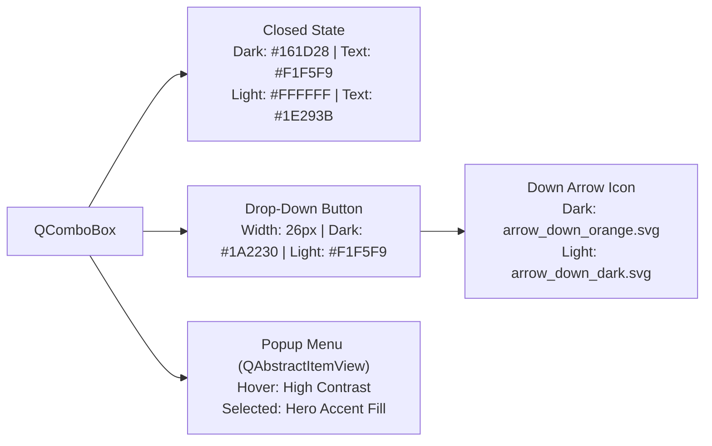
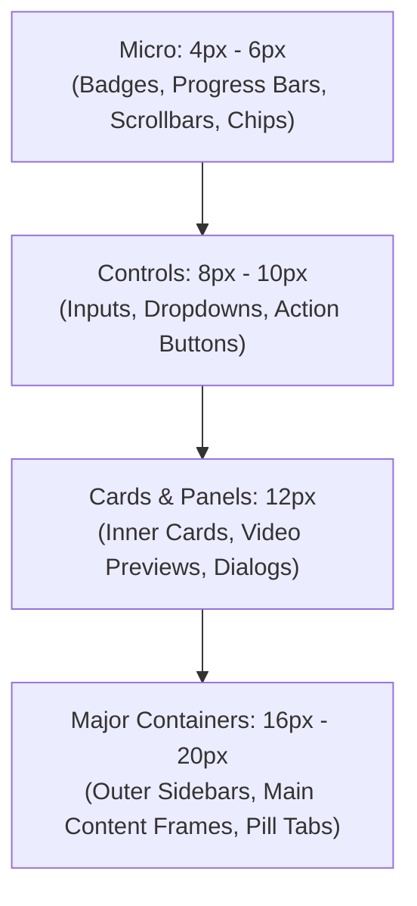

# UI Design System & Pattern Guide

AI Dubber Ultimate adheres to a modern, high-contrast 60-30-10 design system supporting both **Dark Mode** (modeled after `src/dramabox/gui_downloader.py`) and **Light Mode** (glare-free slate/cloud architecture).

---

## 1. Architectural Philosophy: The 60-30-10 Rule

A clean, modern user interface avoids rainbow color schemes. By strictly limiting the primary visual design to **3 core color roles**, the application achieves maximum visual hierarchy and reduced cognitive load across both themes.

### Dark Mode (Default)
| Role | Percentage | Hex Token | RGB | Purpose & Guidelines |
|------|:----------:|:---------:|:---:|----------------------|
| **1. Base Canvas** | **60%** | `#0F141C` | `rgb(15, 20, 28)` | Deep obsidian backdrop. Forms the foundation of windows, viewport wells, unselected scrollbar tracks, and dialog backdrops. Gives high contrast without harsh pure black glare. |
| **2. Structural Surface** | **30%** | `#161D28` | `rgb(22, 29, 40)` | Structural containers, cards, floating panels, text input wells (`#0D121B`), table backgrounds, and drawer sidebars. Paired with subtle `1px solid #212936` borders. |
| **3. Hero Accent** | **10%** | `#F97316` | `rgb(249, 115, 22)` | Vibrant flame orange hero accent. Reserved exclusively for primary CTAs (`#primaryBtn`), active tabs, input focus rings, progress bars, and table selections. |

### Light Mode (Cloud / Slate)
| Role | Percentage | Hex Token | RGB | Purpose & Guidelines |
|------|:----------:|:---------:|:---:|----------------------|
| **1. Base Canvas** | **60%** | `#F8FAFC` | `rgb(248, 250, 252)` | Slate cloud off-white base. Eliminates blinding white glare while keeping the workspace clean and modern. |
| **2. Structural Surface** | **30%** | `#FFFFFF` | `rgb(255, 255, 255)` | Pure white elevated cards, group boxes, sidebars, inputs, and table rows. Outlined with clean `1px solid #E2E8F0` resting and `#CBD5E1` elevated borders. |
| **3. Hero Accent** | **10%** | `#EA580C` | `rgb(234, 88, 12)` | Rich flame orange hero accent. Deepened tone calibrated for high contrast and WCAG AAA compliance on light surfaces. |

---

## 2. Select Box (`QComboBox`) Visibility Architecture



### Critical Implementation Rules:
1. **Never Hardcode Inline Backgrounds**:
   - `core_app.py` automatically strips legacy `background-color: white` on startup to prevent white text on white backgrounds.
2. **Explicit Text and Selection Colors**:
   - Closed state text color is explicitly matched to theme text.
   - `QAbstractItemView::item:selected` uses hero accent background with pure white text (`#FFFFFF`).
3. **Dedicated Down-Arrow Indicator**:
   - Custom SVG vector assets (`arrow_down_orange.svg` in dark, `arrow_down_dark.svg` in light) guarantee crisp visibility across all OS display scalings.

---

## 3. Universal Typography & Emoji Icon Stack

```css
font-family: 'Segoe UI', 'Noto Sans Khmer', 'Khmer OS Battambang', 'Noto Color Emoji', 'Segoe UI Emoji', 'Apple Color Emoji', 'PingFang SC', -apple-system, sans-serif;
```

- **Khmer Compatibility**: Fully supported by `apply_khmer_font_patch()` in `src/utils.py`. Subscript consonants and vowel marks are protected from vertical clipping.
- **Emoji & Icon Rendering**: The inclusion of `'Noto Color Emoji'`, `'Segoe UI Emoji'`, and `'Apple Color Emoji'` guarantees that emoji icons on buttons and headers (`📹`, `⚙️`, `✨`, `⏱️`, `📁`, `🎙️`, `🇰🇭`, `🎵`, `💾`, `▶`, `⏹`, `🎯`, `⚡`, `🎬`, `✂️`) display with full-color glyphs rather than broken rectangular boxes.
- **Checkbox & Radio Indicators**:
  - `QCheckBox::indicator:checked` uses `check_white.svg` vector icon.
  - `QRadioButton::indicator:checked` uses `radio_dot_white.svg` vector icon.

---

## 4. Border System & Corner Radius Hierarchy



- **Micro (`4px - 6px`)**: Badges (`QLabel#cardEpBadge`), progress bars, scrollbars, chips.
- **Controls (`8px - 10px`)**: `QLineEdit`, `QTextEdit`, `QComboBox`, standard buttons.
- **Cards & Panels (`12px`)**: Group boxes, inner cards, preview frames.
- **Major Containers (`16px - 20px`)**: Outer sidebars, main content frames, hero CTA pill buttons (`#primaryBtn`).

---

## 5. Spacing Grid (4px / 8px Incremental Scale)

- `4px` (`SPACE_XS`): Micro gaps between icon and text.
- `8px` (`SPACE_SM`): Button vertical padding, input padding, row gaps.
- `10px - 12px` (`SPACE_MD`): Card internal padding, panel margins.
- `14px - 16px` (`SPACE_LG`): Main window layout margins (`setContentsMargins(14, 14, 14, 14)`).
- `20px - 24px` (`SPACE_XL`): Major dialog padding and section dividers.
