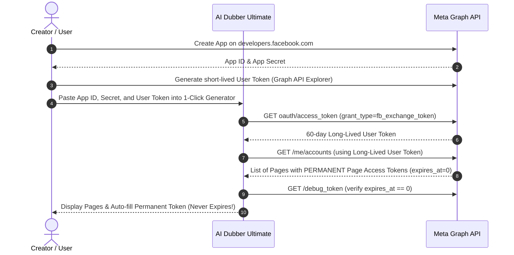

# Facebook Video Posting: Permanent Token & Browser Automation Guide

This guide provides complete technical instructions for uploading videos to Facebook Pages without suffering from access token expiration.

---

## The Problem: Why Do Facebook Tokens Always Expire?

When uploading videos via the Meta Graph API, many developers and creators encounter `OAuthException` error 190: *"Error validating access token: Session has expired"*.

Meta issues tokens with different lifespans:

1. **Short-Lived User Access Token** (generated directly in Graph API Explorer):
   * Lifespan: **1 to 2 hours**.
   * If you query `GET /me/accounts` with this token, the Page Access Tokens returned **also expire in 1 to 2 hours**! This is the most common reason for tokens expiring.

2. **Long-Lived User Access Token**:
   * Lifespan: **60 days**.
   * Generated by exchanging the short-lived token using your Meta `App ID` and `App Secret` with `grant_type=fb_exchange_token`.

3. **Permanent Page Access Token (The Best Solution)**:
   * Lifespan: **NEVER EXPIRES (`expires_at: 0`)**!
   * When `GET /me/accounts` is called using a **Long-Lived User Access Token**, Meta returns Page Access Tokens that **never expire** (unless you explicitly revoke permissions or change your personal password).

4. **System User Token (Enterprise Solution)**:
   * Lifespan: **NEVER EXPIRES**!
   * Created in Meta Business Suite / Business Manager. Assigned directly to a System User with expiration configured to **Never**. It does not break even if personal passwords change.

---

## Solution 1: 1-Click Permanent Page Token (Built into AI Dubber)

AI Dubber Ultimate now includes an automated permanent token exchange tool directly in the **Social Post Manager** UI.



### Step-by-Step Setup:
1. Open [Meta for Developers](https://developers.facebook.com/apps).
2. Create or select your App.
3. In the left sidebar, click **App Settings &rarr; Basic**:
   * Copy your **App ID**.
   * Click "Show" and copy your **App Secret**.
4. In the top navigation, go to **Tools &rarr; Graph API Explorer** (`https://developers.facebook.com/tools/explorer`):
   * Select your App in the dropdown.
   * Under **Permissions**, add:
     - `pages_show_list`
     - `pages_read_engagement`
     - `pages_manage_posts`
     - `publish_video`
   * Click **Generate Access Token** and approve on Facebook.
5. In AI Dubber Ultimate:
   * Open **Social Post Manager** &rarr; go to **Accounts & API Setup** tab.
   * Click **⚡ 1-Click Generate Permanent Token**.
   * Paste your App ID, App Secret, and User Token.
   * Click **⚡ Exchange & Fetch Permanent Page Tokens**.
   * Select your Page from the list (showing `🟢 Permanent (Never Expires)`) and click **✅ Select Page & Apply Permanent Token**.
6. Click **Save All Accounts & Settings**. Your token is now permanent!

---

## Solution 2: Meta Business Suite System User Token (Official Enterprise)

For teams, agencies, or mission-critical servers where you want a bot token completely decoupled from any personal Facebook profile:

1. Open [Meta Business Settings &rarr; System Users](https://business.facebook.com/settings/system-users).
2. Click **Add**:
   * Name: `AIDubberBot`
   * System User Role: **Admin**
3. Under **Assigned Assets**, click **Add Assets**:
   * Select **Pages** &rarr; pick your target Page.
   * Toggle on **Full Control** (Manage Page & Create Content). Click **Save Changes**.
4. Click **Generate New Token**:
   * Select your Meta App.
   * Under **Token Expiration**, choose: **Never**.
   * Check permissions: `pages_manage_posts`, `pages_read_engagement`, `pages_show_list`, `publish_video`.
5. Click **Generate Token** and copy it.
6. In AI Dubber, paste this token directly into **Page Access Token**.
7. Click **🔍 Test Connection & Lifespan**. You will see:
   `🟢 Permanent (Never Expires)`

---

## Solution 3: Browser Automation Video Poster (Zero Developer App / Zero Token)

If you cannot create a Meta Developer App or want to post without dealing with Meta Developer verification, AI Dubber provides `src/facebook_browser_poster.py`.

### How It Works:
* It connects to your existing logged-in Google Chrome profile (from `src/chrome.py` or default Chrome) or session cookies.
* It automates **Meta Business Suite Composer** (`https://business.facebook.com/latest/composer`).
* It uploads the video file, populates Title and Caption/Description, waits for upload completion, and clicks **Publish**.

### Interactive First-Time Login:
To log into Facebook once in your designated Chrome profile:
```bash
python3 src/facebook_browser_poster.py --login
```
Complete login or 2FA in the opened Chrome window, then close it. The session is saved persistently.

### Using Browser Automation Mode directly in the AI Dubber UI:
1. Open **Social Post Manager** &rarr; switch to **Accounts & API Setup** tab.
2. In the **Facebook Page Configuration** card, select:
   `🔘 🌐 Browser Automation (Chrome Profile - Zero Token)`
3. Under **Chrome Profile**, pick your desired logged-in Chrome profile (e.g. `Default`, `Profile 2`).
   *(Click `🔄 Refresh Profiles` at any time to re-scan your Chrome installation)*.
4. Click **`🔑 Open Chrome to Log In / Check Session`** to ensure your profile has an active Facebook session.
5. (Optional) Check **Run Headless (Background)** if you want video uploads to run silently in the background.
6. Click **Save All Accounts & Settings**.
7. In the main publishing tab, you will see `Mode: 🌐 Browser (<Profile>)`. Select your video or folder and click **🚀 Publish to Selected Platforms**—the background worker will automate the upload seamlessly!

### Publishing a Video via CLI:
```bash
python3 src/facebook_browser_poster.py \
    --video "output/my_dubbed_video.mp4" \
    --title "Episode 1: The New Adventure" \
    --description "Dubbed in Khmer by AI Dubber Ultimate #viral #video" \
    --profile-name "Default"
```

### Python Programmatic Usage:
```python
from facebook_browser_poster import FacebookBrowserPoster

poster = FacebookBrowserPoster(profile_name="Default", headless=False)
result = poster.post(
    video_path="/path/to/video.mp4",
    title="My Video Title",
    description="Check out this dubbed episode! #AIDubber",
)
print("Upload status:", result)
```

---

## Summary of Options

| Feature | Meta Permanent Page Token (Solution 1) | Meta System User (Solution 2) | Browser Automation (Solution 3) |
| :--- | :--- | :--- | :--- |
| **Token Expiry** | **Never Expires** | **Never Expires** | No Token Needed |
| **Upload Speed** | ⚡ Extremely Fast (Resumable 4MB chunks) | ⚡ Extremely Fast (Resumable 4MB chunks) | Normal Browser Speed |
| **Setup Complexity** | Low (1-Click in App) | Low (Business Suite UI) | Very Low (Chrome Profile) |
| **Requires Meta App?** | Yes (App ID + Secret) | Yes | **No** |
| **Target Audience** | General creators & automation | Agencies & dedicated servers | Users without Dev accounts |
